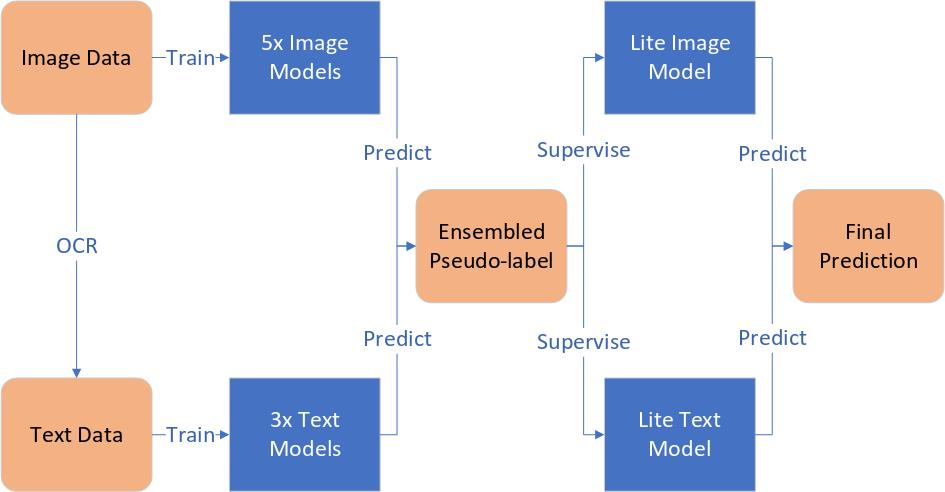

# Xfyun-Ad-Classification

[**iFLYTEK AI开发者大赛 广告图片素材分类算法挑战赛**](https://challenge.xfyun.cn/topic/info?type=ad-2021)代码

# 更新

PPT已提供

# **目录**
- [环境](#环境) 

- [外部工具](#外部工具) 

- [基本使用](#基本使用)

- [**复现**](#复现)

# 环境

- 使用conda或pip安装

```sh
cuda=10.2
python=3.8.0 # conda安装
torch=1.7.1  # conda安装
pytorch_lightning=1.4.5 # pip安装
timm=0.4.9              # pip安装 
transformers=4.9.2      # pip安装
albumentations=1.0.0    # pip安装
```

# 外部工具

- OCR库[chineseocr_lite](https://github.com/DayBreak-u/chineseocr_lite/tree/master) (*含个人修改*)

- [我个人的深度学习工具库](https://github.com/CarnoZhao/utils)


# 基本使用

1. 数据集来源于官方竞赛网站

2. `OCR.py`用于提取图像中文本

3. `Solver{Image|Text}.py`用于图像、文本训练

4. `Extractor{Image|Text}.py`用于图像、文本softmax概率提取

5. `Ensembler.py`用于多模态集成

6. `Solver_{Image|Text}_Pseudo.py`用于图像、文本伪标签训练

7. `Inferencer.py`用于最终预测

# 复现

> 太长不看：中间模型体积太大，这里只提供了最后用伪标签训练的模型（不在github上提供），在`./weights`。所以没能给出完整的训练日志。如果只用于预测，只需要执行`python Inferencer.py`，结果将会保存在./submission.csv`。

---

## **0. 注意**:

### 0.1 可复现性

即使我已经尽可能设定了随机种子，但是我没有而测试外部代码`OCR`和`autoalbu`的可复现性。这里的流程估计/期望可以在复赛榜上取得*0.907~0.909*（第三）的得分。


### 0.2 测试数据

所有代码以*复赛测试集*为目标，被命名为`test_B`或`testB`。


### 0.3 GPU设备

- **训练**需要*2x TITAN RTX*或*2x RTX 3090*，至少需要*2x 24G = 48G*显存。

- **仅测试**只需要*6-8G*显存

### 0.4 训练时间

- 使用*2x TITAN RTX*，一个图像模型的训练时间是4~6小时，一个文本模型的训练时间是1~2小时。

### 0.5 训练超参数

- `autoalbu`策略（需要训练）: `./autoalbu/configs/latest.json`

- OCR配置: `./chineseocr_lite/config.py`

- 深度学习训练: `./hparams/*.yaml`

    - `yaml`文件以`pseudo_`开头的是用于伪标签训练的超参数。

---

## 1. 数据预处理

### 1.1 文件夹结构

- 下载数据到`./data`，按如下方式整理：

```
|--data
   |--train
   |   |--0
   |   |  |--xxx.jpg
   |   |  |--xxx.jpg 
   |   |
   |   |--1
   |   |--...
   |
   |--test_B
       |--xxx.jpg
       |--xxx.jpg
```

### 1.2 图像数据OCR

- OCR代码是基于开源库修改的 (`master`分支): [chineseocr_lite](https://github.com/DayBreak-u/chineseocr_lite.git)  (感谢作者)

- OCR基础代码在`./chineseocr_lite`. 和原库相比, 我只改了`./chineseocr_lite/config.py`中的一些配置然后删除了一些没用的代码和模型。这些变化没有在本库中记录。

- (**执行！**) 

```
python OCR.py
```

提取`train`和`test_B`数据集图像中的文本信息。结果分别保存在`./data/train.tsv`和`./data/testB.tsv`。

> NOTE: 我对OCR并不了解，所以没有做太多的模型选择，只是在github上找了较为简单的一个

### 1.3 自动数据增强Auto-albumentations 

- 具体的使用和安装请参考[autoalbument](https://albumentations.ai/docs/autoalbument/)

    - `autoalbu`的`pytorch-lightning`需求可能和本库的`pytorch-lightning`版本有冲突，最好依官方安装建立一个独立的环境执行。

- 自动数据增强代码在`./autoalbu`

- `在`./autoalbu/configs`设置必要的`dataset.py`和`search.yaml

- (**执行！**) 
```
cd ./autoalbu

autoalbument-search --config-dir configs
```

- 因为loss在15个epoch后没有下降了，为了节省时间，我在第17个epoch手动停止了训练。训练的结果保存在`./autoalbu/configs/outputs/{执行日期}/{执行时间}/policy/`

- 为了精简github库的，我没有保留所有的`autoalbu`训练结果，只把我所得到的策略放在了`./autoalbu/configs/latest.json`。

> NOTE:  在后续模型训练中，如果要使用`autoalbu`的策略，需要手动指定策略路径

---

## 2. 模型训练

### 2.1 主要思想

- 分别训练图像模型和文本模型

- 融合图像模型和文本模型的预测结果

- 根据**知识蒸馏**和**半监督学习**：

    - 用集成得到的伪标签训练更小的图像模型和文本模型

    - **知识蒸馏**：用大模型的集成指导小模型学习

    - **半监督学习**：用无标签数据的伪标签学习

- 集成蒸馏得到的小模型的输出，作为最终的输出结果


_流程_

### 2.2 图像模型训练

- 模型（见[timm](https://github.com/rwightman/pytorch-image-models.git)）:

    - `tf_efficientnet_b4_ns`

    - `tf_efficientnetv2_m_in21ft1k`

    - `eca_nfnet_l1`

    - `resnet200d`

    - `swin_base_patch4_window12_384`

- 超参数

    ```python
    args = dict(
        seed = 0,
        learning_rate = 1e-3,
        model_name = #?#,
        num_epochs = 30,
        batch_size = 64,
        fold = -1,         # 使用全部的训练数据
        num_classes = 137, # 类别数
        smoothing = 0.1,   # 标签平滑
        classes = None,    # （没用）
        alpha = 0.4,       # mixup的alpha值
        swa = True,         # 使用随机权重平均？
        image_size = #?#,  # 训练图像大小
        drop_rate = 0.3,   # dropout概率
        name = "image/#?#",    # 日志保存目录
        version = "sorted_all" # 日志保存目录
    )
    ```

    - `args['model_name']`是刚才提到的5个模型

    - `args['image_size']`在`tf_efficientnet_b4_ns`和 `tf_efficientnetv2_m_in21ft1k`中是**512**, 其他3个模型是**384**。

    - `args['name']`代表各个模型中的单独命名，下面是我使用的命名： 

        - `tf_efficientnet_b4_ns`: "image/b4ns"

        - `tf_efficientnetv2_m_in21ft1k`: "image/ev2m"

        - `eca_nfnet_l1`: "image/nfl1"

        - `resnet200d`: "image/200d"

        - `swin_base_patch4_window12_384`: "image/swb"

- (**执行5次！**) 

    - 在`Solver_Image.py`中设定超参数 

    - 对每个模型执行下面的命令

```
python Solver_Image.py
```

- 日志会保存在`./logs/image/{args['name']}`

### 2.3 文本模型训练

- 模型（见 [Chinese-BERT-wwm](https://github.com/ymcui/Chinese-BERT-wwm)）:

    - `hfl/chinese-roberta-wwm-ext`

    - `hfl/chinese-bert-wwm-ext`

    - `hfl/chinese-bert-wwm`

- 超参数

    ```python
    args = dict(
        learning_rate = 2e-5,
        model_name = #?#,
        num_epochs = 30,
        batch_size = 64,
        fold = -1,
        num_classes = 137,
        smoothing = 0.1,
        alpha = 0,
        max_length = 256,
        drop_rate = 0.3,
        swa = #?#,
        name = "text/#?#",
        version = "sorted_all"
    )
    ```

    - `args['model_name']`是刚才提到的3个模型

    - `args['swa']`在`hfl/chinese-bert-wwm`是`False`（因为我自己机器的一些bug），其他是`True`.

    - `args['name']`代表各个模型中的单独命名，下面是我使用的命名：  

        - `hfl/chinese-roberta-wwm-ext`: "rbt"

        - `hfl/chinese-bert-wwm-ext`: "bt"

        - `hfl/chinese-bert-wwm`: "btwwm"

- (**执行3次！**) 

    - 在`Solver_Text.py`中设定超参数 

    - 对每个模型执行下面的命令

```
python Solver_Text.py
```

- 日志会保存在`./logs/text/{args['name']}`

---

## 3. 多模态融合

### 3.1 提取softmax概率

- 设置`Extractor_Image.py`中的模型检查点路径

- 设置`Extractor_Text.py`中的模型检查点路径

- (**执行！**)

```
mkdir -p ./data/features
python Extractor_Image.py
python Extractor_Text.py
```

- 提取的概率/特征会保存在`./data/features`

### 3.2 集成特征

- 设置`Ensembler.py`中的所需特征的路径

- 这里的集成只使用了最简单的加权平均，因为其他复杂的方法会影响模型效果

- (**执行！**)

```
mkdir -p ./data/pseudo
python Ensembler.py
```

- 集成得到的伪标签会保存在`./data/pseudo`

---

## 4. 知识蒸馏+半监督学习

- 设置`Solver_Pseudo.py`中的伪标签路径

- 为了平衡伪标签的不准确性，这里使用了更少的数据增强、mixup、dropout和标签平滑

- 模型选择:

    - 对于图像模型，我选择了一个小型模型： `tf_efficientnet_b0_ns`

    - 对于文本模型,因为小型模型`hfl/rbt3`效果不理想, 我依然使用了`hfl/chinese-roberta-wwm-ext`

- (**执行！**)

```
python Solver_Image_Pseudo.py
python Solver_Text_Pseudo.py
```

- 日志会保存在`./logs/pseudo`

---

## 5. 最终预测输出

- 在`Inferencer.py`中设置蒸馏后模型的途径（图像模型和文本模型）

- (**执行！**)

```
python Inferencer.py
```

- 预测结果会保存在`./submission.csv`，格式符合竞赛要求

---
